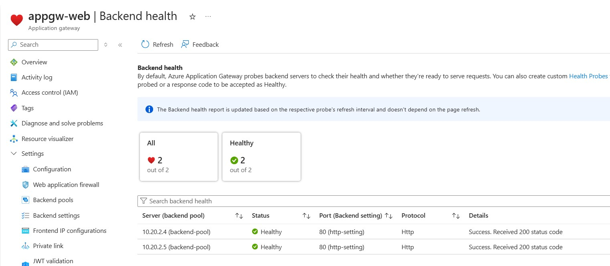
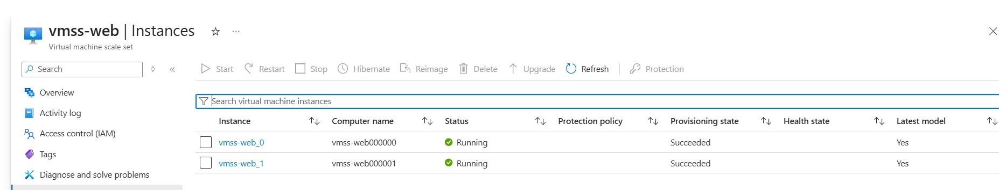
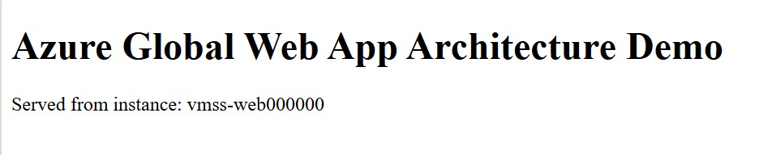
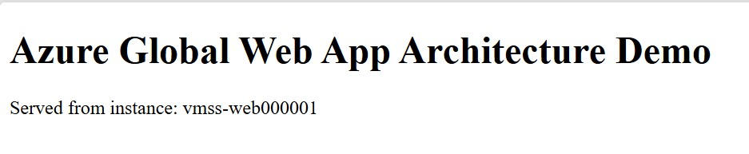
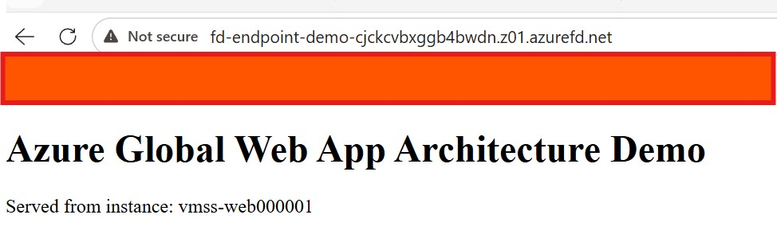
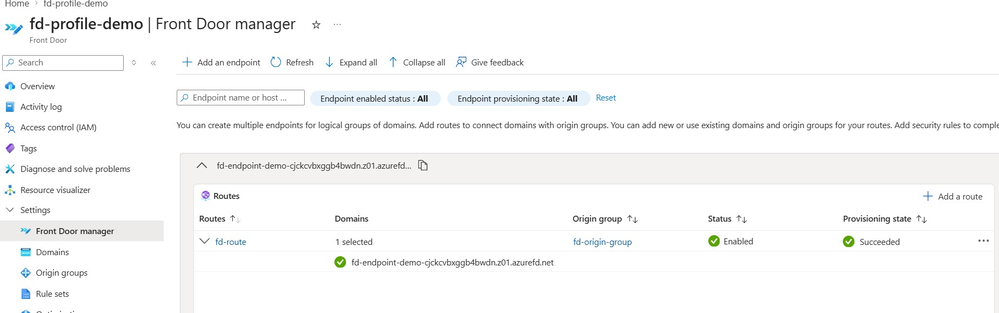

# 🌍 Azure Global Web App Architecture Demo  

This project demonstrates a multi-tier Azure architecture using global and regional load balancing components.

🧱 Architecture
Internet → Azure Front Door → Application Gateway → VM Scale Set → Nginx

## 🔹 Components
### Azure Front Door (Standard)  
- Global Layer 7 load balancer   
- Public entry point (*.azurefd.net)  
- Routes traffic to backend origin  
### Azure Application Gateway (Standard_v2)  
- Regional Layer 7 load balancer  
- Handles HTTP routing and health probes  
- Backend pool connected to VM Scale Set  
### Azure VM Scale Set (Linux)  
- 2 instances
- Nginx installed via custom script
- Displays hostname to demonstrate load distribution


## Architecture Overview

### High-Level Architecture


🔹 How It Works

1. User accesses the Front Door endpoint:
http://<your-endpoint>.azurefd.net  
2. Azure Front Door routes the request to:    
Application Gateway public IP (configured as origin)    
3. Application Gateway forwards traffic to:    
VM Scale Set instances (backend pool)    
4. Nginx responds with:    
Instance hostname (e.g. vmss-web000001)


🔹 Important Notes
- ⚠️ HTTP only (current version)  
-- The architecture is configured for HTTP traffic only  
-- HTTPS is not enabled in this version
-- Browsers may automatically attempt HTTPS, causing failures
- ⚠️ Front Door Origin Configuration
-- Backend origin is configured using Application Gateway public IP
-- Works for lab/demo scenarios
-- In production, FQDN should be used instead
- ⚠️ Cost Optimization
-- Resources are deployed via Terraform  
  -- Recommended workflow:   
terraform apply → test → terraform destroy

🔹 Validation

The solution was validated by:

- Accessing Front Door endpoint over HTTP
- Verifying response from multiple VMSS instances
- Confirming end-to-end routing:  
Front Door → App Gateway → VMSS

🚀 Future Improvements
- Enable HTTPS on Front Door
- Add WAF (Web Application Firewall)
- Implement multi-region failover
- Replace IP-based origin with DNS-based configuration

## Repository Structure

```text
azure-global-webapp-architecture/
├── README.md
├── architecture/
│   ├── design.md
│   └── diagram-placeholder.md
├── terraform/
│   ├── provider.tf
│   ├── variables.tf
│   ├── main.tf
│   ├── network.tf
│   ├── vmss.tf
│   ├── appgw.tf
│   ├── outputs.tf
│   └── terraform.tfvars.example
├── app/
│   ├── install-nginx.sh
│   └── index.html
├── scripts/
│   └── test-load.ps1
└── .github/
    └── workflows/
        └── deploy.yml
```

## Demo

### Application Gateway Backend Health


### VM Scale Set Instances


### Web Application Response



### Azure Front Door




## Why This Project Matters

This repository is meant as a practical cloud portfolio project, not just a lab. It demonstrates how several Azure services work together in a realistic web hosting scenario.

It can be used to discuss topics such as:

- Load Balancer vs Application Gateway vs Front Door
- regional vs global traffic distribution
- autoscaling patterns
- health probes and backend pools
- Layer 4 vs Layer 7 design choices
- high availability in Azure

   ## Technologies Used
  
- Microsoft Azure
- Terraform
- Azure Front Door
- Azure Application Gateway
- Azure VM Scale Sets
- GitHub Actions
- Linux / Nginx
  
  ## Deployment Notes

The Terraform configuration is designed to be modular enough for learning and portfolio purposes.

Before deployment, update the values in terraform.tfvars and make sure you are authenticated to Azure.

Typical workflow:

```text   
terraform init  
terraform plan  
terraform apply
```

## Future Improvements

Possible improvements for future iterations:

add Azure Front Door Standard/Premium
enable Web Application Firewall
add a second region for failover
use custom domain and TLS
publish architecture diagram
add CI/CD automation with GitHub Actions and OIDC federation
Author

This project was created as part of my Azure architecture and cloud engineering portfolio, with focus on practical design, infrastructure automation, and interview-ready cloud scenarios.


---
